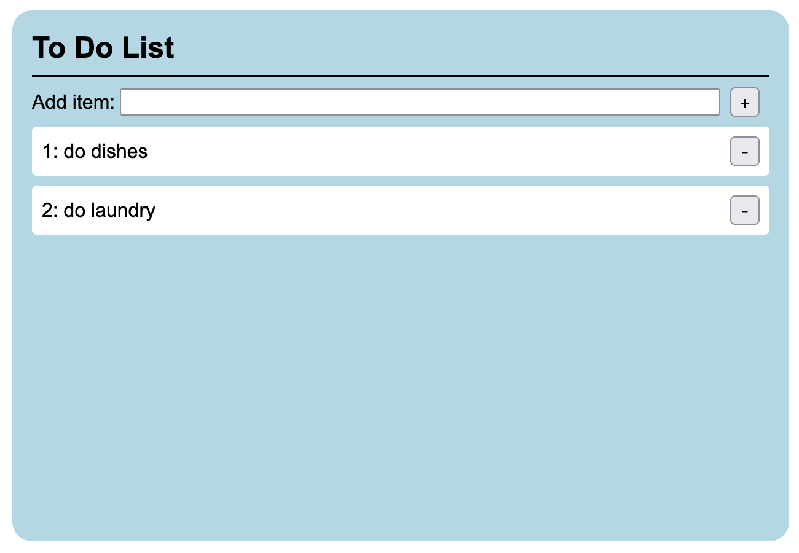

# To Do List

Simple to do list in TypeScript and React.

Add and remove to do items.

## How to run

In the project directory, run `npm install` then `npm start`.

Open [http://localhost:3000](http://localhost:3000) to view it in your browser.